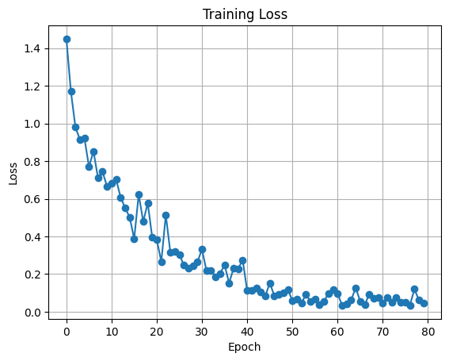

# Train ResNet on CIFAR-10 from scratch

**Note: Refer to Training_ResNet_CIFAR10_with_Colossal_AI.ipynb for logs**

- The model used in the experiment: Resnet18
- The dataset employed: CIFAR10
- Parallel settings (if any): NIL (using single GPU on Google Colab)

This example provides a training script and an evaluation script. The training script provides an example of training ResNet on CIFAR10 dataset from scratch.

- Training Arguments

  - `-p`, `--plugin`: Plugin to use. Choices: `torch_ddp`, `torch_ddp_fp16`, `low_level_zero`. Defaults to `torch_ddp`.
  - `-r`, `--resume`: Resume from checkpoint file path. Defaults to `-1`, which means not resuming.
  - `-c`, `--checkpoint`: The folder to save checkpoints. Defaults to `./checkpoint`.
  - `-i`, `--interval`: Epoch interval to save checkpoints. Defaults to `5`. If set to `0`, no checkpoint will be saved.
  - `--target_acc`: Target accuracy. Raise exception if not reached. Defaults to `None`.

- Eval Arguments
  - `-e`, `--epoch`: select the epoch to evaluate
  - `-c`, `--checkpoint`: the folder where checkpoints are found

## Instructions on how to run code

I did not use the requirements txt. Follow [Step 1](#step-1-build-colossalai-from-source) to set up the environment.

### Step 1: Build ColossalAI from source

```
conda create -n resnet18_cifar10_colossalai python=3.12 -y
conda activate resnet18_cifar10_colossalai
git clone https://github.com/hpcaitech/ColossalAI.git
cd ColossalAI
pip install .
```

### Step 2: Train Resnet18 from scratch on CIFAR10

Note that argument for --nproc_per_node depends on number of GPUs available. In my case, I am using a single GPU environment in Google Colab, hence --nproc_per_node is set to 1.

```
cd /content/ColossalAI/examples/images/resnet
!colossalai run --nproc_per_node 1 train.py -c ./ckpt-fp32
```

### Step 3: Evaluate trained Resnet18 model

```bash
# evaluate fp32 training
python eval.py -c ./ckpt-fp32 -e 80
```

### Experiment results, presented in a table or figure

Expected accuracy performance will be:

| Model     | Single-GPU Baseline FP32 | Booster DDP with FP32 | Booster DDP with FP16 | Booster Low Level Zero | Booster Gemini |
| --------- | ------------------------ | --------------------- | --------------------- | ---------------------- | -------------- |
| ResNet-18 | 85.85%                   | 84.91%                | 85.46%                | 84.50%                 | 84.60%         |


**Note: the baseline is adapted from the [script](https://pytorch-tutorial.readthedocs.io/en/latest/tutorial/chapter03_intermediate/3_2_2_cnn_resnet_cifar10/) to use `torchvision.models.resnet18`**
